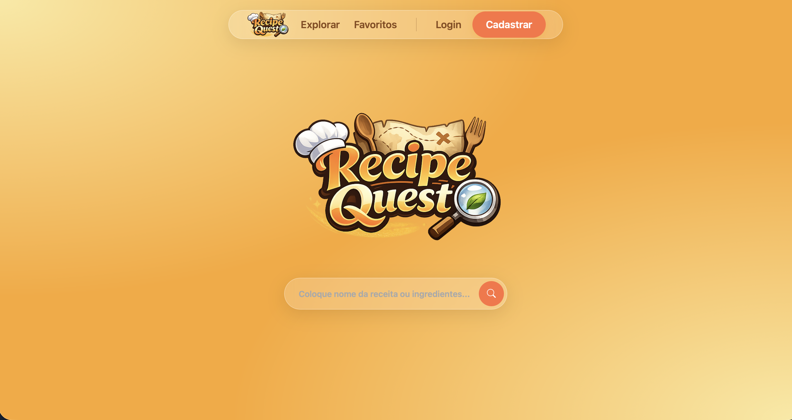
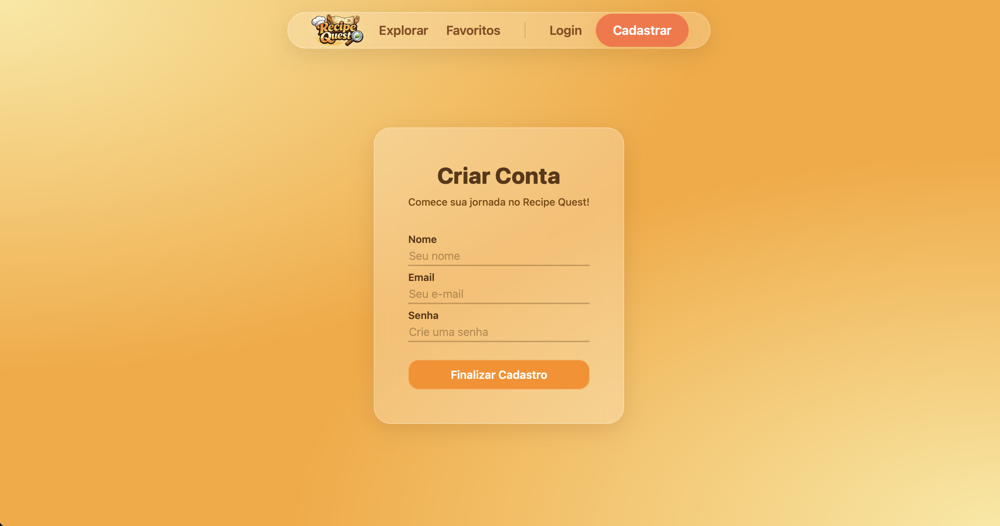
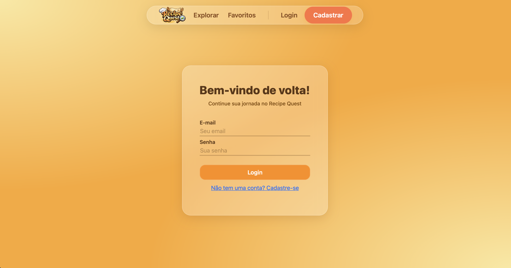
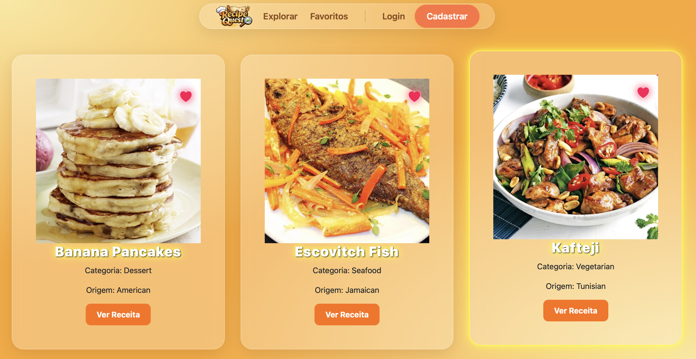

# 🍳 Recipe Quest

> Uma jornada culinária para descobrir receitas incríveis com o que você tem à mão.

O **Recipe Quest** é uma aplicação Full-stack que permite aos usuários explorar receitas através da API TheMealDB, filtrar por categorias (Vegano, Sobremesas, etc.) e gerenciar seus favoritos com persistência de dados.

---

## 🚀 Tecnologias Utilizadas

Este projeto foi construído com a stack moderna de desenvolvimento web:

- **Frontend:** [React.js](https://reactjs.org/) + [Vite](https://vitejs.dev/)
- **Backend:** [FastAPI](https://fastapi.tiangolo.com/) (Python 3.x)
- **Banco de Dados:** [PostgreSQL](https://www.postgresql.org/) (via SQLAlchemy ou Tortoise ORM)
- **Consumo de API:** Axios
- **Roteamento:** React Router Dom

---
## 📸 Interface (WIP)
> ⚠️ *Nota: As capturas de tela abaixo são de uma versão preliminar. Alterações visuais podem ocorrer conforme o progresso do desenvolvimento.*

### Home

### Cadastro

### Login

### Favoritos

### Detalhes de Receita

---

## 🛠️ Funcionalidades Planejadas

- [ ] **Sistema de Autenticação:** Login e Cadastro com JWT (JSON Web Tokens).
- [ ] **Busca:** Pesquisa por nome ou ingredientes.
- [ ] **Filtros Dinâmicos:** Filtre por dieta (Vegano/Vegetariano) ou área (Italiana, Japonesa, etc).
- [ ] **Favoritos:** Salve suas receitas preferidas no banco de dados.
- [ ] **Página de Detalhes:** Visualização completa de ingredientes e modo de preparo.

